# **Tempest Shaders** 

Tempest Shaders is a shader pack for Minecraft.  
It is made from Rinrin's mad sensibility.  
Recommended for you, who want to experience a different scenery than usual <3 

---

## Download 

See [releases](https://github.com/Rinrin0413/Tempest_Shaders/releases)

---

## Requirements

Platform: `Minecraft for Windows` 
Version: `v1.16.100 or earlier` or `x86(32bit) before 1.18.12 or earlier`

Render Dragon is not supported.

---

## Major features

- Deep shadow
- Beautiful lighting
- Fancy sky & clouds
- Colorful stars
- Realistic reflections with normal mapping
- Waving plants
 

reflective blocks list

- Chiseled Deepslate
- Cracked Deepslate Bricks
- Cracked Deepslate Tiles
- Deepslate Bricks
- Deepslate {Coal, Copper, Diamond, Emerald, Gold, Iron, Lapis, Redstone} Ore
- Deepslate Tiles
- Polished Deepslate
- {Crimson, Warped} Stem
- Amethyst Block
- Amethyst Cluster
- Ancient Debris
- Anvil
- Bedrock
- Bee Nest(honey)
- Beehive(honey)
- Blast Furnace
- Blue Ice
- Bone Block
- Border
- Brewing Stand
- Brick
- Budding Amethyst
- Cartography Table
- Cauldron
- Cave Vines(berries)
- Chain Command Block
- Chain
- Chiseled Nether Bricks
- Chiseled Polished Blackstone
- Block of Coal
- Coal Ore
- Command Block
- Block of Copper(also waxed ones)
- Copper Ore
- Cracked Nether Bricks
- Cracked Polished Blackstone Bricks
- Crafting Table
- Crying Obsidian
- Cut Copper(also waxed ones)
- Daylight Sensor
- Block of Diamond
- Diamond Ore
- Iron Door
- Dragon Egg
- Block Emerald
- Emerald Ore
- Enchantment Table
- End Portal(frame)
- Exposed Copper(also waxed ones)
- Exposed Cut Copper(also waxed ones)
- Frosted Ice
- Gilded Blackstone
- Glass
- Stained Glasses(all)
- Stained Glass Pane(all)
- Tinted Glass
- Glazed Terracotta(all)
- Glow Item Frame
- Glow Lichen
- Glowstone
- Block of Gold
- Gold Ore
- Honey Block
- Honeycomb Block
- Hopper
- Ice
- Packed Ice
- Iron Bars
- Block of Iron
- Iron Ore
- Iron Trapdoor
- Jigsaw Block
- Lantern
- Lapis Lazuli Block
- Lapis Lazuli Ore
- Large Amethyst Bud
- Lightning Rod
- Lodestone
- Magma Block
- Medium Amethyst Bud
- Monster Spawner
- Nether Brick Block
- Nether Gold Ore
- Block of Netherite
- Obsidian
- Polished Blackstone
- Cracked Polished Blackstone Bricks
- Portal
- Prismarine Bricks
- Dark Prismarine
- Prismarine
- Purpur Block
- Purpur Pillar
- Block of Quartz
- Chiseled Quartz Block
- Pillar Quartz Block
- Quartz Bricks
- Smooth Quartz Block
- Quartz Ore
- Activator Rail
- Detector Rail
- Powered Rail
- Rail
- Block of Raw Copper
- Block of Raw Gold
- Block of Raw Iron
- Red Nether Brick
- Block of Redstone
- Redstone Lamp(also liting ones)
- Redstone Ore
- Repeating Command Block
- Respawn Anchor
- Sea Lantern
- Shroomlight
- Slime Block
- Small Amethyst Bud
- Smithing Table
- Smoker(liting only)
- Soul Lantern
- Polished Andesite
- Polished Diorite
- Polished Granite
- Smooth Stone
- Stone Bricks
- Chiseled Stone Bricks
- Cracked Stone Bricks
- Mossy Stone Bricks
- Stonecutter(newer)
- Structure Block
- Tinted Glass
- Weathered Copper(also waxed ones)
- Weathered Cut Copper(also waxed ones)

---

## Pictures

click to expand

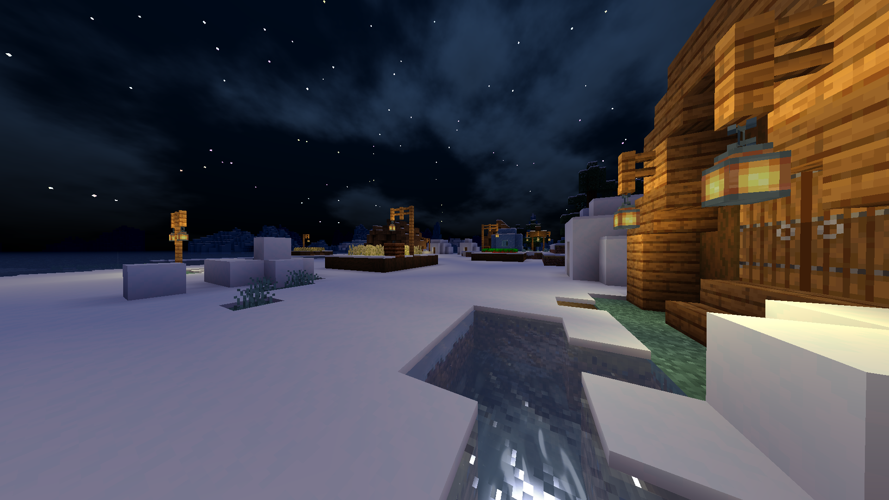
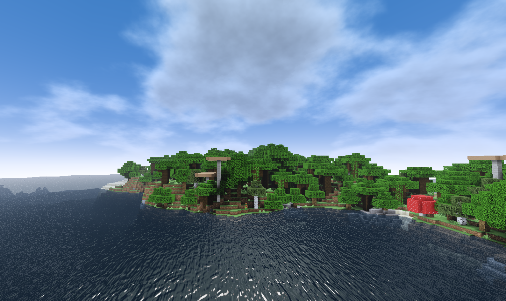
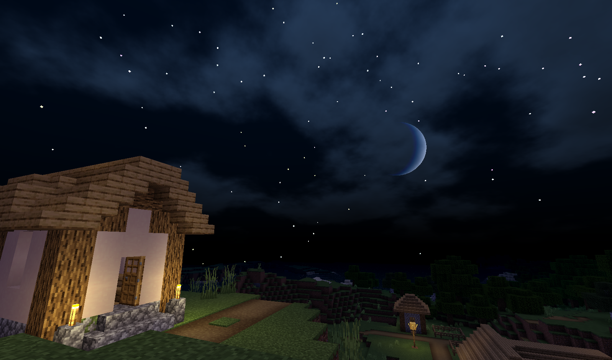
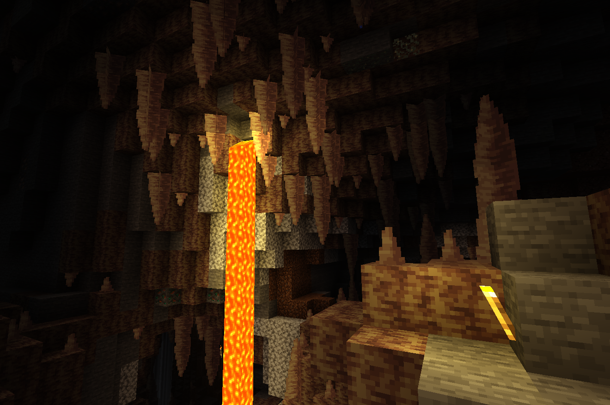
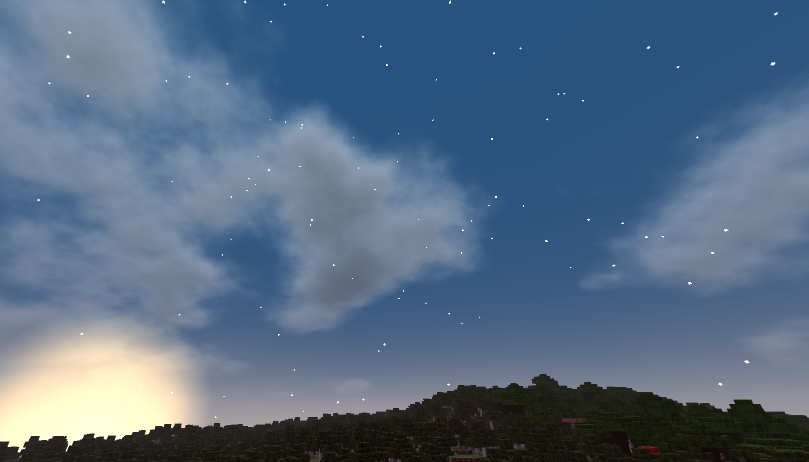
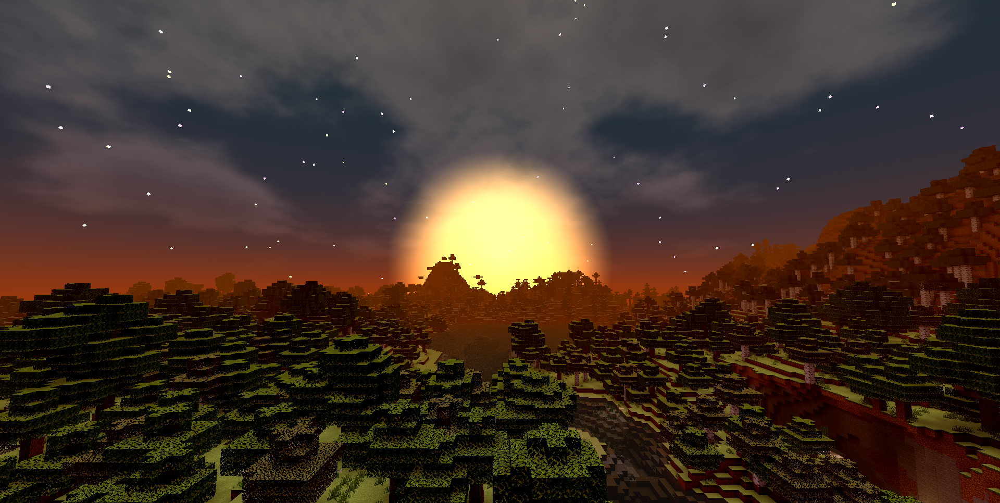
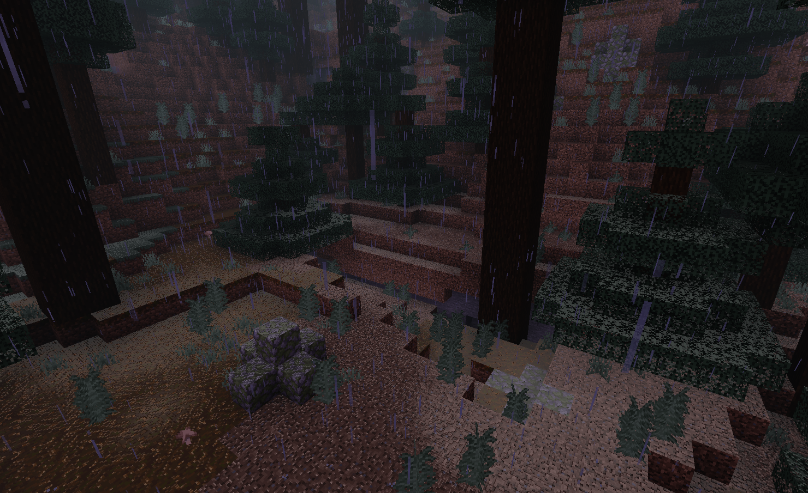
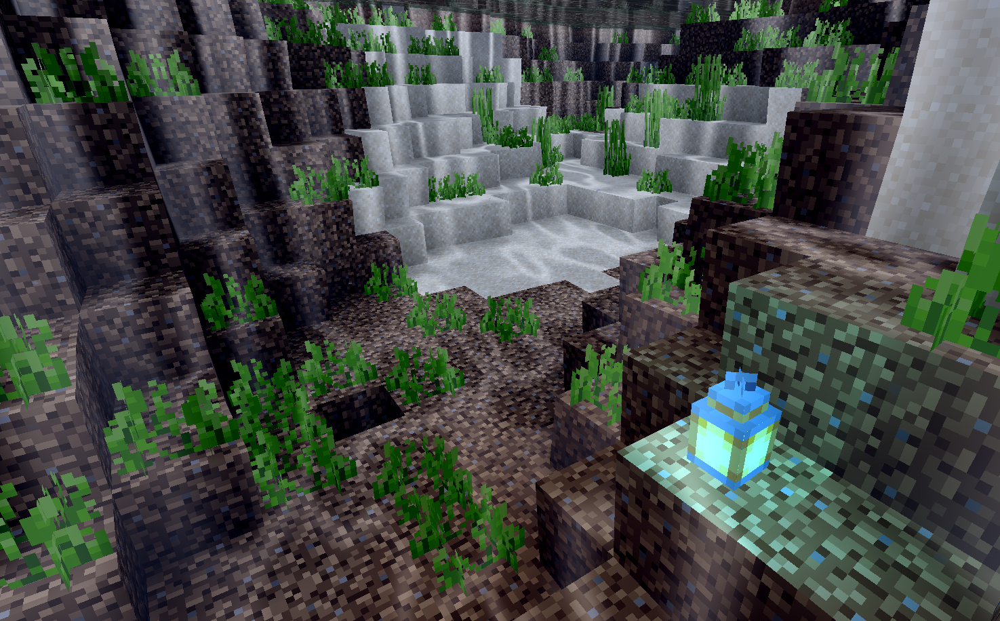
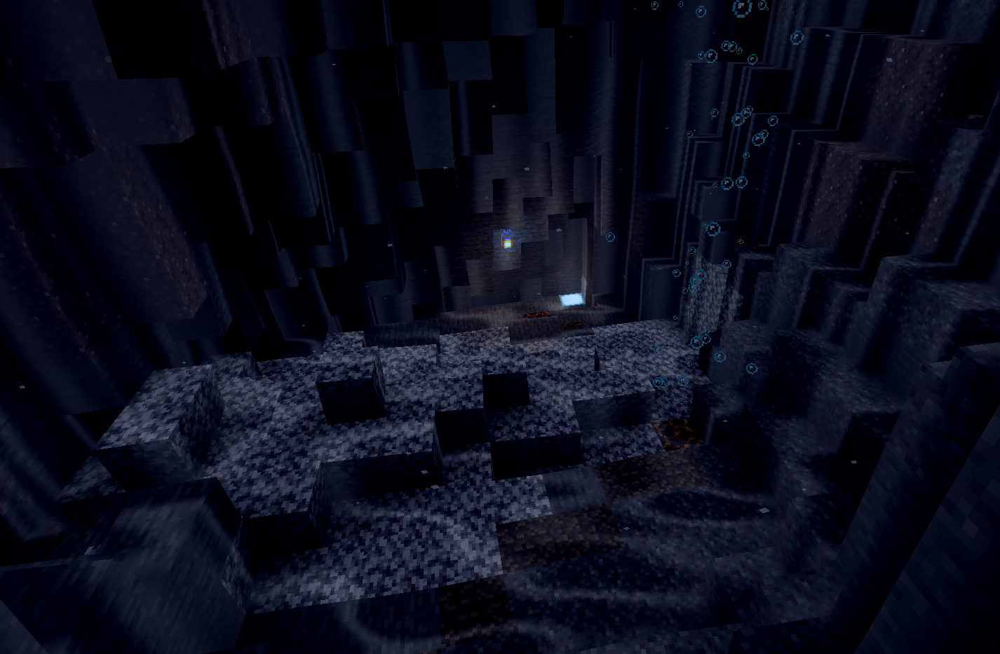
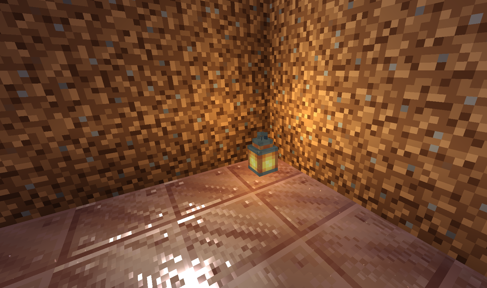

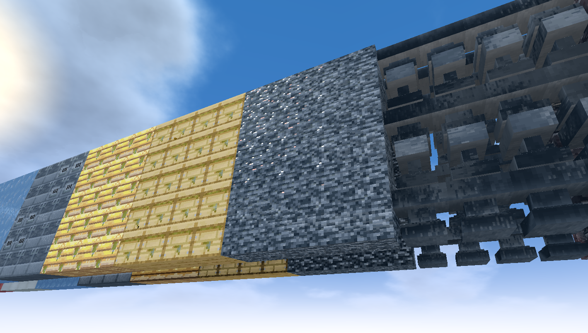
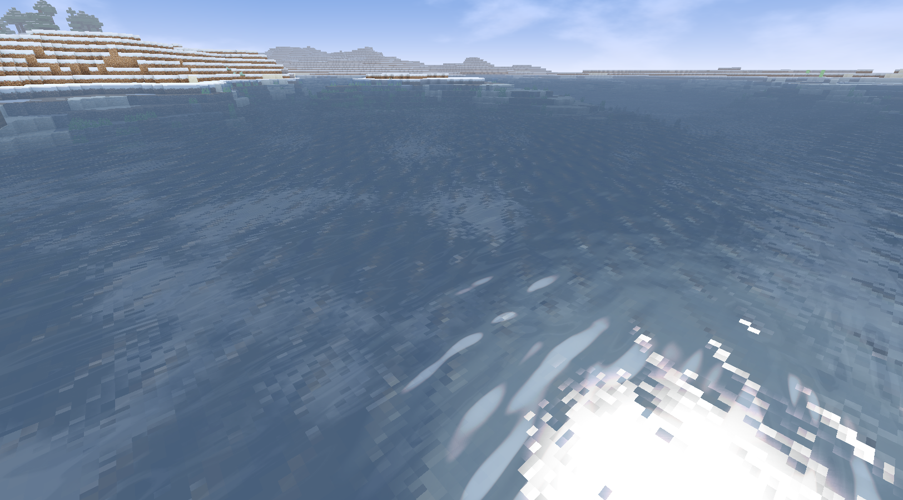
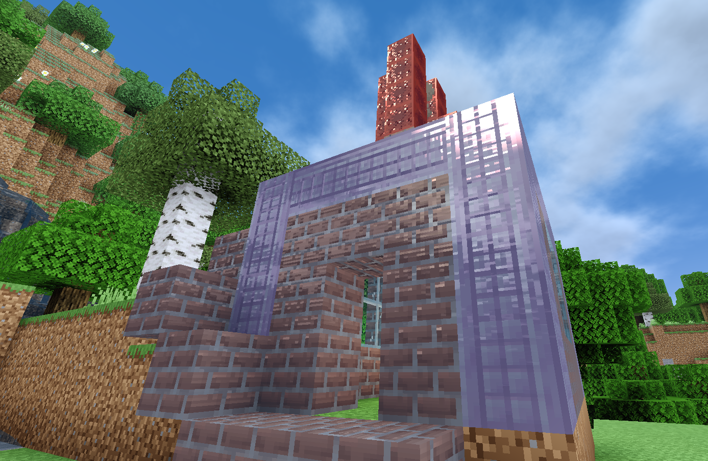
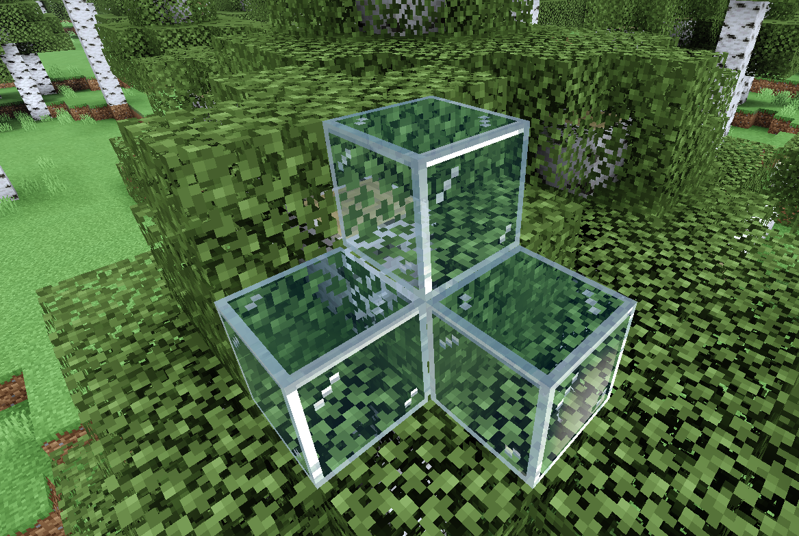

---

## Known issues

- Some plants emit unnatural light under certain conditions

---

## License

 

&emsp;

---